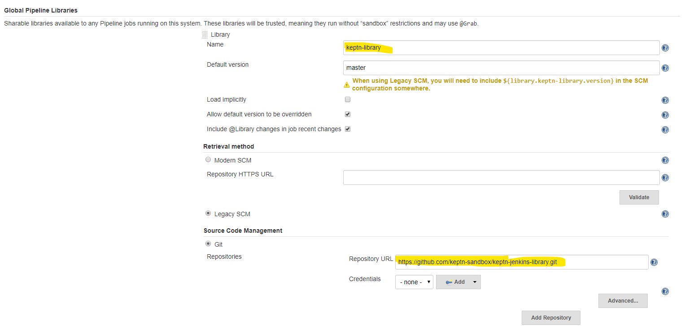
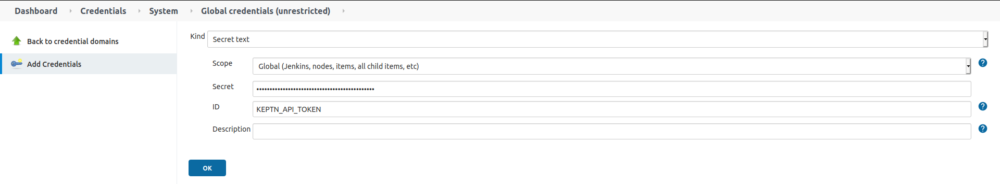
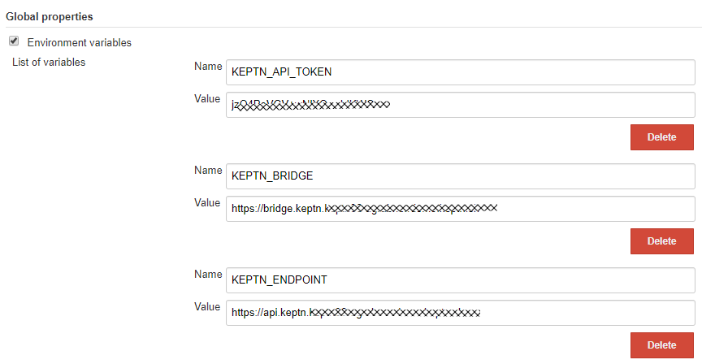

# Keptn Jenkins Shared Library


Jenkins shared library for integrating Keptn Use Cases within your Jenkins Pipelines.


## Compatibility matrix

You can find out the latest release on the [GitHub releases](https://github.com/keptn-sandbox/keptn-jenkins-library/releases) page.

| Library Version | Keptn Version | Comment                      |
| --------------- | --------------| ---------------------------- |
| 1.0             | 0.6.x         | Initial Release              |
| 2.0             | 0.6.x         | Better Pipeline Result Handling |
| 2.1             | 0.6.x         | Validate existing project in keptnInit |
| 2.2             | 0.6.x         | Adding custom label support for Keptn 0.6.x |
| 3.0             | 0.7.x         | Supporting 0.7.0 API Endpoints |
| 3.1             | 0.7.x         | Sending *buildId* label to Keptn |
| 3.2             | 0.7.x         | Adding custom label support for Keptn 0.7.x |
| 3.3             | 0.7.x         | Improved Evaluation done event handling in Keptn |
| 3.4             | 0.7.x         | Implementing #9 to customize image and tag |
| 3.5             | 0.7.x         | Keptn API Token now configurable via Jenkins Credentials |
| 4.0             | 0.8.0         | Now supporting Keptn 0.8.0 |
| 4.1             | 0.8.x, 0.9.x  | Supporting Keptn 0.9.x, bug fixes |

Please make sure to always specify a version when including the library in your Jenkinsfile, e.g.
```groovy
@Library('keptn-library@4.1')
import sh.keptn.Keptn
def keptn = new sh.keptn.Keptn()
```

## Watch the tutorial webinar on YouTube

As part of a Keptn Community Webinar we walked through all use cases supported by this Jenkins Shared Library (click image to play video):

[](https://www.youtube.com/watch?v=VYRdirdjOAg "Level Up your Jenkins with Keptn Video Tutorial")

## Pre-Requisits on Jenkins
This Jenkins Shared Library requires the following Jenkins Plugins to be installed on your Jenkins
| Jenkins Plugin | Comment | Tested Version |
| -------------- | -------- | ------------ |
| [httpRequest Plugin](https://plugins.jenkins.io/http_request/) | Uses httpRequest to make REST Calls to Keptn | Tested with 1.8.26 | 
| [Pipeline Utility Step Plugin](https://plugins.jenkins.io/pipeline-utility-steps/) | Uses readJSON, writeJSON | Tested with 2.5.0 |
| [Credentials Plugin](https://plugins.jenkins.io/credentials/) | Uses CredentialsProvider (installed by default) | Tested with 2.3.15 |
| [Plain Credentials Plugin](https://plugins.jenkins.io/plain-credentials/) | Uses StringCredentials (installed by default) |Tested with 1.7 |

## Usage
In order to use this Jenkins Shared Library simply configure it in your Global Jenkins Configuration. Here is one way of doing this by pulling it from this GitHub repo:


The library also needs the following variables to be set. They can be configured in multiple ways. Order of precedence is the order they are listed in (e.g. KEPTN_ENDPOINT configured as argument and as global variable, argument takes precedence)
* KEPTN_ENDPOINT (argument in initKeptn or as global variable)
* KEPTN_BRIDGE (argument in initKeptn or as global variable)
* KEPTN_API_TOKEN (global variable or as 'Secret Text' credential)

Configuration as additional arguments in `keptnInit`:
```groovy
keptn.keptnInit keptn_endpoint:"https://api.keptn...", keptn_bridge:"https://bridge.keptn...", ...
```

Configuration as 'Secret Text' credential:



Configuration as global variable:



You can obtain Keptn API Token and Endpoint as explained in the Keptn doc:
```
KEPTN_ENDPOINT=https://api.keptn.$(kubectl get cm keptn-domain -n keptn -ojsonpath={.data.app_domain})
KEPTN_API_TOKEN=$(kubectl get secret keptn-api-token -n keptn -ojsonpath={.data.keptn-api-token} | base64 --decode)
```
The KEPTN_BRIDGE is the link to your keptn bridge so that the Library can generate some deep links to the bridge to give you easy access to quality gate results!

Once you have everything configured use it in your Jenkins Pipeline like this

```groovy
@Library('keptn-library@4.1')
import sh.keptn.Keptn
def keptn = new sh.keptn.Keptn()


// Initialize Keptn: "Link" it to your Jenkins Pipeline
// -------------------------------------------
// initialize keptn: will store project, service and stage in a local context file so you don't have to pass it to all other functions
keptn.keptnInit project:"yourproject", service:"yourservice", stage:"yourstage"

// initialize keptn with Shipyard: if a shipyard file is passed keptnInit will also make sure this project is created in Keptn
// This allows you to automatically create a Keptn project for your Jenkins pipeline w/o having to do anything with Keptn directly
keptn.keptnInit project:"yourproject", service:"yourservice", stage:"yourstage", shipyard:'shipyard.yaml'


// Upload your SLIs, SLOs, Test Scripts ... to Keptn
// --------------------------------------------
// If you want to fully automate the Keptn configuration you should upload your sli.yaml, slo.yaml and optionally files such as your tests
// First parameter defines the file in your local Jenkins Workspace, the second one the location Keptn will use to store it in its own Git
keptn.keptnAddResources('keptn/sli.yaml','dynatrace/sli.yaml')
keptn.keptnAddResources('keptn/slo.yaml','slo.yaml')
keptn.keptnAddResources('keptn/load.jmx','jmeter/load.jmx')

// Custom Labels
// all keptn.send** functions have an optional parameter called labels. It is a way to pass custom labels to the sent event
def labels=[:]
labels.put('TriggeredBy', 'Andi')

// Quality Gate Evaluation Use Case
// ------------------------------------------
// Start a quality gate evaluation. There are multiple timeframe options, e.g: using timestamps or number minutes from Now()
// Example #1: Evaluate the last 10 minutes
def keptnContext = keptn.sendStartEvaluationEvent starttime:"600", endtime:"0" 

// Example #2: Evaluate the previous hour. End=Now()-3600, Start=Now()-7200
def keptnContext = keptn.sendStartEvaluationEvent starttime:"7200", endtime:"3600" 

// Example #3: Evaluate a specific timeframe
def keptnContext = keptn.sendStartEvaluationEvent starttime:"2019-06-07T07:00:00.0000Z", endtime:"2019-06-07T08:00:00.0000Z", labels: labels

// Example #4: Mark a starting timestamp before executing your tests
// Following example will fill starttime with the time when you called markEvaluationStartTime and as end is empty will default to Now()
keptn.markEvaluationStartTime()
... here is where you would execute any existing tests
def keptnContext = keptn.sendStartEvaluationEvent starttime:"", endtime:"" 
echo "Open Keptns Bridge: ${keptn_bridge}/trace/${keptnContext}"


// Performance Testing as a Service Use Case
// -------------------------------------------
// If we want Keptn to execute a test against a specific URL we simply inform Keptn about a new deployment
// After Keptn executes the tests it will also evaluate the quality gate for the timeframe the test took to execute
def keptnContext = keptn.sendDeploymentFinishedEvent testStrategy:"performance", deploymentURI:"http://yourapp.yourdomain.local"
echo "Open Keptns Bridge: ${keptn_bridge}/trace/${keptnContext}"


// Progressive Delivery Use Case
// -------------------------------------------
// If you want Keptn to deploy, test and evaluate then we can simply inform Keptn about a new configuration (=container image) you have
// Typically you would use your Jenkins to build and push a container to your container registry. After that you notify Keptn about it
def keptnContext = keptn.sendConfigurationChangedEvent image:"docker.io/grabnerandi/simplenodeservice:3.0.0", labels : labels
echo "Open Keptns Bridge: ${keptn_bridge}/trace/${keptnContext}"

//Keptn 0.8.x uses the following for the Delivery Use Case
// -------------------------------------------
def keptnContext = keptn.sendConfigurationTriggeredEvent testStrategy:"${params.TestStrategy}", deploymentURI:"${params.DeploymentURI}"
String keptn_bridge = env.KEPTN_BRIDGE
echo "Open Keptns Bridge: ${keptn_bridge}/trace/${keptnContext}"

// Waiting for Quality Gate Result
// --------------------------------------------
def result = keptn.waitForEvaluationDoneEvent setBuildResult:true, waitTime:waitTime
echo "${result}"
```

## Tutorials

If you want to see more examples go here: [Keptn Jenkins Tutorials](https://github.com/keptn-sandbox/jenkins-tutorial)

## Contributors

A big thanks to all [maintainers](CODEOWNERS) and [contributors](https://github.com/keptn-sandbox/keptn-jenkins-library/graphs/contributors)!

## License

See [LICENSE](LICENSE).
